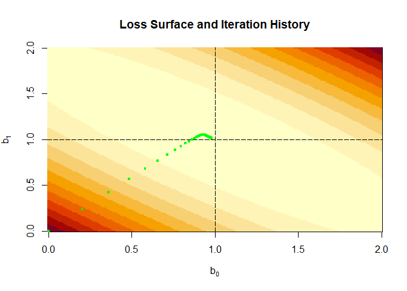
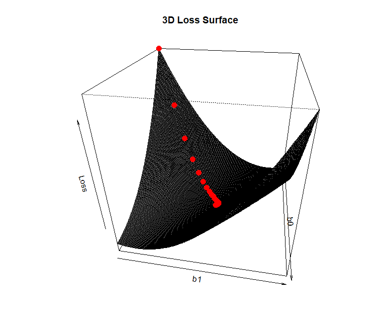

# Gradient Descent (GD)

-   Learning Material for
    [Differential](https://gisyaliny.github.io/notes/Math/Advance-Math/Chapter2-Differential/)
-   Learning Material for [Linear
    Algbra](https://gisyaliny.github.io/notes/Math/Linear-Algbra/Chapter1-Interpretaion/)
-   Learning Material for [Linear Algbra
    (Video)](https://www.youtube.com/watch?v=ZK3O402wf1c&list=PL49CF3715CB9EF31D&index=1&ab_channel=MITOpenCourseWare)

## Introduction to Gradient Descent

`Gradient Descent` is an optimization algorithm used to minimize a
function by **iteratively** moving in the direction of steepest descent.
It is widely used in machine learning to minimize the cost function.

The basic idea is to update the parameters (`weights`) of a model in the
**opposite direction** of the gradient of the cost function with respect
to the parameters.


## Stochastic Gradient Descent (SGD)

-   [Reference](https://en.wikipedia.org/wiki/Stochastic_gradient_descent)

`Stochastic Gradient Descent (SGD)` is a variant of gradient descent
where, instead of computing the gradient of the entire dataset, we
compute the gradient of the cost function with respect to the parameters
based on a **single training example** at each iteration. \* This makes
SGD much **faster** and more **scalable**, especially for large
datasets.

### General algorithm for implementing SGD

1.  Initialize the model parameters randomly or with some predefined
    values.

2.  Shuffle the training dataset.

3.  For each training example:

-   Compute the gradient of the cost function with respect to the
    parameters using the current training example.

-   Update the parameters in the direction opposite to the gradient by a
    small step size (`learning rate`).

1.  Repeat the process until convergence or for a fixed threshold of
    iterations.

## Example: Linear Regression with GD

### Simulate linear regression data

*y* = 1 + *x* + *e*, where *e* ~ normal(0,0.25)

``` r
set.seed(1)
b0 <- 1; b1 <- 1; n <- 200
x <- runif(n,0,2)
y <- b0 + b1*x + rnorm(n, sd=0.25)
summary(lm(y~x))
```

    ## 
    ## Call:
    ## lm(formula = y ~ x)
    ## 
    ## Residuals:
    ##      Min       1Q   Median       3Q      Max 
    ## -0.72323 -0.15560 -0.01819  0.16244  0.66273 
    ## 
    ## Coefficients:
    ##             Estimate Std. Error t value Pr(>|t|)    
    ## (Intercept)  1.00136    0.03831   26.14   <2e-16 ***
    ## x            0.99771    0.03285   30.37   <2e-16 ***
    ## ---
    ## Signif. codes:  0 '***' 0.001 '**' 0.01 '*' 0.05 '.' 0.1 ' ' 1
    ## 
    ## Residual standard error: 0.2493 on 198 degrees of freedom
    ## Multiple R-squared:  0.8233, Adjusted R-squared:  0.8224 
    ## F-statistic: 922.4 on 1 and 198 DF,  p-value: < 2.2e-16

plot the dataset

``` r
plot(y~x, ylim=c(0,4), main="Simulated Regression Data")
abline(lm(y~x), col="red")
```


### Define loss function and gradient search function

-   [Loss function in
    `torch`](https://pytorch.org/docs/stable/nn.html#loss-functions)

In this example, we use MSE (squared L2 norm) as our loss function, we
ignore *n* since it will not change the optimum solution position

$MSE = \frac{1}{n}\sum(y-\hat y)^2=\frac{1}{n}\sum(y-(\hat \beta_0+\hat \beta_1x))^2$

``` r
##
lossFct <- function(y,x,b0,b1){
  sum((y-(b0+b1*x))^2)
} #end::lossFct
```

To minimize the MSE, we use gradient descent. The gradient of the MSE
with respect to the parameters *β̂*<sub>0</sub> and *β̂*<sub>1</sub> are
computed as follows:

-   [More
    Info](https://gisyaliny.github.io/notes/Statistics/Into-to-Statistic/Chapter3-Linear-Regression/#ordinary-least-squares)

$$
\frac{\partial f}{\partial \hat \beta_0} = -\frac{2}{n}\sum_i(y_i-(\hat \beta_0+\hat \beta_1x_i))
$$

$$
\frac{\partial f}{\partial \hat \beta_1} = -\frac{2}{n}\sum_ix_i(y_i-(\hat \beta_0+\hat \beta_1x_i))
$$

Then, we move the current estimated parameter *β*<sub>0</sub> and
*β*<sub>1</sub> to the opposite direction of gradients by *α* (also
called `learning rate`) steps, here is the equation
$$
\hat \beta_0^{new}=\hat \beta_0^{old} - \frac{\partial f}{\partial \hat \beta_0} \* \alpha
$$

$$
\hat \beta_1^{new}=\hat \beta_1^{old} - \frac{\partial f}{\partial \hat \beta_1}\* \alpha
$$

``` r
gradientUpdateFct <- function(y, x, b0Old, b1Old, alpha) {
  # The objective is to move to a minimum loss

  # Compute the derivative of the loss function with respect to b0
  derivb0 <- -2 * sum((y - (b0Old + b1Old * x)))    # at optimum equal to zero
  
  # Compute the derivative of the loss function with respect to b1
  derivb1 <- -2 * sum(x * (y - (b0Old + b1Old * x)))  # at optimum equal to zero
  
  # Update the parameters b0 and b1 using the gradients and learning rate alpha
  b0New <- b0Old - derivb0 * alpha / length(x)
  b1New <- b1Old - derivb1 * alpha / length(x)
  
  # Return the updated parameters as a vector
  return(c(b0New, b1New))
}
```

### Start Iteration

In this example, we set \* `alpha` (`learning rate`) as 0.05 \*
`treshold` as 0.0005 \* `maxIter` as 200

We can start *β̂*<sub>0</sub> and *β̂*<sub>1</sub> randomly, but for
visualization purpose, we set both as 0 at first

``` r
## Set parameters controlling the gradient descent search and history
b0 <- 0; b1 <- 0             # Set starting values
loss <- lossFct(y, x, b0, b1)   # Loss at start
threshold <- 0.0005          # Change in the loss for gradient descent
alpha <- 0.05                # Learning rate: update step length
maxIter <- 200               # Maximum iterations for gradient descent

plot(y ~ x, ylim = c(0, 4), main = "Simulated Regression Data")
abline(lm(y ~ x), col = "red")

## Start iterative search
abline(a = b0, b = b1, col = "green")  # Starting regression line
i <- 1
iterHist <- rbind(NULL, c(i, b0, b1, loss))
lossOld <- Inf

while (abs(lossOld - loss) > threshold) {
  i <- i + 1
  lossOld <- loss
  b <- gradientUpdateFct(y, x, b0, b1, alpha)
  b0 <- b[1]
  b1 <- b[2]
  loss <- lossFct(y, x, b0, b1)
  iterHist <- rbind(iterHist, c(i, b0, b1, loss))

  if ((i %% 5) == 0) {  # Plot results of every 5th iteration
    abline(a = b0, b = b1, col = "green")  # Updated regression line
    cat("Iteration:", i, "| Estimated Beta_0:", round(b0, 4), "| Estimated Beta_1:", round(b1, 4), "| Loss:", round(loss, 4), "\n")
    if (i > maxIter) break
    Sys.sleep(0.5)  # Slow down for visualization
  }  # end::if
}  # end::while
```

    ## Iteration: 5 | Estimated Beta_0: 0.581 | Estimated Beta_1: 0.6809 | Loss: 130.0938 
    ## Iteration: 10 | Estimated Beta_0: 0.8234 | Estimated Beta_1: 0.9576 | Loss: 22.0329 
    ## Iteration: 15 | Estimated Beta_0: 0.8957 | Estimated Beta_1: 1.0328 | Loss: 13.34 
    ## Iteration: 20 | Estimated Beta_0: 0.9197 | Estimated Beta_1: 1.0512 | Loss: 12.6129 
    ## Iteration: 25 | Estimated Beta_0: 0.9297 | Estimated Beta_1: 1.0537 | Loss: 12.5278 
    ## Iteration: 30 | Estimated Beta_0: 0.9356 | Estimated Beta_1: 1.0518 | Loss: 12.4974 
    ## Iteration: 35 | Estimated Beta_0: 0.9402 | Estimated Beta_1: 1.0488 | Loss: 12.4743 
    ## Iteration: 40 | Estimated Beta_0: 0.9441 | Estimated Beta_1: 1.0458 | Loss: 12.4542 
    ## Iteration: 45 | Estimated Beta_0: 0.9477 | Estimated Beta_1: 1.0428 | Loss: 12.4366 
    ## Iteration: 50 | Estimated Beta_0: 0.9511 | Estimated Beta_1: 1.0399 | Loss: 12.4212 
    ## Iteration: 55 | Estimated Beta_0: 0.9543 | Estimated Beta_1: 1.0373 | Loss: 12.4076 
    ## Iteration: 60 | Estimated Beta_0: 0.9573 | Estimated Beta_1: 1.0348 | Loss: 12.3957 
    ## Iteration: 65 | Estimated Beta_0: 0.96 | Estimated Beta_1: 1.0325 | Loss: 12.3853 
    ## Iteration: 70 | Estimated Beta_0: 0.9626 | Estimated Beta_1: 1.0303 | Loss: 12.3761 
    ## Iteration: 75 | Estimated Beta_0: 0.9651 | Estimated Beta_1: 1.0282 | Loss: 12.368 
    ## Iteration: 80 | Estimated Beta_0: 0.9674 | Estimated Beta_1: 1.0263 | Loss: 12.361 
    ## Iteration: 85 | Estimated Beta_0: 0.9695 | Estimated Beta_1: 1.0245 | Loss: 12.3547 
    ## Iteration: 90 | Estimated Beta_0: 0.9715 | Estimated Beta_1: 1.0228 | Loss: 12.3493 
    ## Iteration: 95 | Estimated Beta_0: 0.9734 | Estimated Beta_1: 1.0212 | Loss: 12.3445 
    ## Iteration: 100 | Estimated Beta_0: 0.9751 | Estimated Beta_1: 1.0198 | Loss: 12.3403 
    ## Iteration: 105 | Estimated Beta_0: 0.9768 | Estimated Beta_1: 1.0184 | Loss: 12.3366 
    ## Iteration: 110 | Estimated Beta_0: 0.9783 | Estimated Beta_1: 1.0171 | Loss: 12.3333 
    ## Iteration: 115 | Estimated Beta_0: 0.9798 | Estimated Beta_1: 1.0159 | Loss: 12.3305

``` r
abline(lm(y ~ x), col = "red")  # Plot final regression line again
```


``` r
cat("\nFinal solution gradient descent\nBeta_0:", round(iterHist[nrow(iterHist), 2], 4), "| Beta_1:", round(iterHist[nrow(iterHist), 3], 4), "\n")
```

    ## 
    ## Final solution gradient descent
    ## Beta_0: 0.9809 | Beta_1: 1.0149

It convergence before 200 round iterations.

### Visualize the loss surface

``` r
b0Grid <- seq(0,2, by=0.01)
b1Grid <- seq(0,2, by=0.01)

##
## Setup loss surface
##
lossValMat <- matrix(NA, nrow = length(b0Grid), ncol = length(b1Grid))
for (i in 1:length(b0Grid)) {
  for (j in 1:length(b1Grid)) {
    lossValMat[i, j] <- lossFct(y, x, b0Grid[i], b1Grid[j])
  }
}

##
## Plot loss surface and iteration history
##
image(b0Grid, b1Grid, lossValMat, ,xlab=expression(b[0]),ylab=expression(b[1]),
      main="Loss Surface and Iteration History")
abline(v=coef(lm(y~x))[1], h=coef(lm(y~x))[2], lty="longdash")
points(iterHist[1:nrow(iterHist),2:3], pch=".", cex=4, col="green")
```



``` r
b0Grid <- seq(0, 2, by = 0.01)
b1Grid <- seq(0, 2, by = 0.01)

lossValMat <- matrix(NA, nrow = length(b0Grid), ncol = length(b1Grid))
for (i in 1:length(b0Grid)) {
  for (j in 1:length(b1Grid)) {
    lossValMat[i, j] <- lossFct(y, x, b0Grid[i], b1Grid[j])
  }
}

# Create the 3D plot
persp3D <- persp(b0Grid, b1Grid, lossValMat, theta = 100, phi = 30,
      xlab = "b0", ylab = "b1", zlab = "Loss",
      main = "3D Loss Surface", shade = 0.75, # Adjust shading for better visibility
      box = TRUE)  # Add a box around the plot

trans3d <- trans3d(x = iterHist[, 2], y = iterHist[, 3], z = iterHist[, 4],
                   pmat = persp3D)
points(trans3d, pch = 19, col = "red", cex = 1.5)
```



## Example with SGD

The process is very similar to GD, but we do not compute the gradients
from whole dataset, but from samples

``` r
set.seed(123)

epochs <- 20          # number of steps

b0Old <- 0;  b1Old <- 0  # Start values for coefficients

for (i in 1:epochs){
  jSeq <- sample(1:n,size = 20)    # Random sequence of observations
  for (j in jSeq){
    b <- gradientUpdateFct(y[j],x[j],b0Old,b1Old,alpha)
    b0Old <- b[1]
    b1Old <- b[2]
  } # end::oneLine
} # end::epoch


cat("\nFinal solution single observation:
    b0: ", b0Old, "b1: ", b1Old,"\n")
```

    ## 
    ## Final solution single observation:
    ##     b0:  1.040424 b1:  0.9717855
